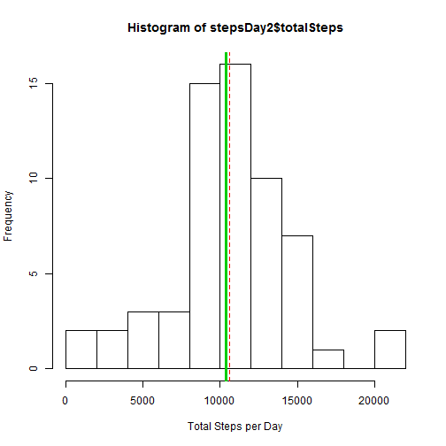
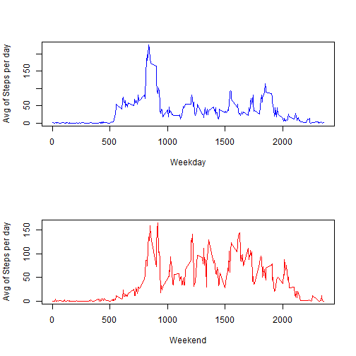

Reproducible Research, Peer Assesment #1
========================================


```
## Warning: package 'dplyr' was built under R version 3.1.3
```

```
## 
## Attaching package: 'dplyr'
## 
## The following object is masked from 'package:stats':
## 
##     filter
## 
## The following objects are masked from 'package:base':
## 
##     intersect, setdiff, setequal, union
```
### Loading and preprocessing the data
Show any code that is needed to Load the data (i.e. read.csv()). Process/transform the data (if necessary) into a format suitable for your analysis.


```r
pamd <- read.csv("activity.csv") ##read the initial file
```

### What is mean total number of steps taken per day?

For this part of the assignment, you can ignore the missing values in the dataset. Make a histogram of the total number of steps taken each day Calculate and report the mean and median total number of steps taken per day.

```r
stepsDay <- as.data.frame(pamd %>% group_by(date) %>% summarise(sum(steps)))
dayMedian <- apply(stepsDay,2, FUN = median, na.rm = TRUE)
colnames(stepsDay)[2] <- "totalSteps" ##rename column
dayMedian <- as.numeric(dayMedian)
```

```
## Warning: NAs introduced by coercion
```

```r
dayMean <- mean(stepsDay$totalSteps, na.rm = TRUE)

hist(stepsDay$totalSteps,breaks=8,xlab="Total Steps per Day")
abline(v=dayMedian,col=3,lwd=3) ## green line at the median
abline(v=dayMean,col=4,lty=2)##dotted blue line at the mean
```

 

### What is the average daily activity pattern?

Make a time series plot (i.e. type = "l") of the 5-minute interval (x-axis) and the average number of steps taken, averaged across all days (y-axis). Which 5-minute interval, on average across all the days in the dataset, contains the maximum number of steps?

```r
pamd2 <- pamd[complete.cases(pamd),]
stepsInterval <- as.data.frame(pamd2 %>% group_by(interval) %>% summarise(total = sum(steps)/61))

highestAvg <- max(stepsInterval$total, na.rm=TRUE) #get highest avg
tmp = subset(stepsInterval, total == highestAvg)

plot(x=stepsInterval$interval,y=stepsInterval$total,type='l')
points(tmp$interval,tmp$total,type="p")
abline(v=tmp$interval,col=4,lty=2)
```

 

The interval containing the highest average steps is **835**, which I derived by subsetting the data based on an average equal to the highest average, as shown below:

```r
tmp = subset(stepsInterval, total == highestAvg)
```
### Imputing missing values

Note that there are a number of days/intervals where there are missing values (coded as NA). The presence of missing days may introduce bias into some calculations or summaries of the data.

Calculate and report the total number of missing values in the dataset (i.e. the total number of rows with NAs). Devise a strategy for filling in all of the missing values in the dataset. The strategy does not need to be sophisticated. For example, you could use the mean/median for that day, or the mean for that 5-minute interval, etc.

Create a new dataset that is equal to the original dataset but with the missing data filled in.

In order to deal with missing values, I chose to replace the missing value with the mean value for the interval in which the missing value existed.  The code to complete that looks like this:

```r
alldata <- full_join(pamd,stepsInterval, by="interval") ##join original data with subset of averages at each interval
alldata$steps[is.na(alldata$steps)] <- alldata$total[is.na(alldata$steps)]##copy the mean column into steps column, where steps is NA

stepsDay2 <- as.data.frame(alldata %>% group_by(date) %>% summarise(sum(steps)))
dayMedian2 <- apply(stepsDay2,2, FUN = median, na.rm = TRUE)
dayMedian2 <- as.numeric(dayMedian2)
```

```
## Warning: NAs introduced by coercion
```

```r
colnames(stepsDay2)[2] <- "totalSteps" ##rename column
stepsDay2$totalSteps <- as.integer(stepsDay2$totalSteps)
dayMean2 <- mean(stepsDay2$totalSteps)
```

Make a histogram of the total number of steps taken each day and Calculate and report the mean and median total number of steps taken per day. Do these values differ from the estimates from the first part of the assignment? What is the impact of imputing missing data on the estimates of the total daily number of steps?

```r
x11()
hist(stepsDay2$totalSteps,breaks=8,xlab="Total Steps per Day")
abline(v=dayMedian2,col=3,lwd=3) ## green line at the median
abline(v=dayMean2,col=2,lty=2)
```

 

### Are there differences in activity patterns between weekdays and weekends?

For this part the weekdays() function may be of some help here. Use the dataset with the filled-in missing values for this part.

Create a new factor variable in the dataset with two levels -- "weekday" and "weekend" indicating whether a given date is a weekday or weekend day.

```r
alldata$date <- as.character(alldata$date)
alldata$date <- as.Date(alldata$date)

weekdays1 <- c('Monday', 'Tuesday', 'Wednesday', 'Thursday', 'Friday')
alldata$wDay <-  factor((weekdays(alldata$date) %in% weekdays1)+1L,
                    levels=1:2, labels=c('weekend', 'weekday'))
weekdays <- subset(alldata, wDay=="weekday")
weekends <- subset(alldata, wDay=="weekend")

numdays <- length(unique(weekdays$date))
dayavg <- as.data.frame(weekdays %>% group_by(interval) %>% summarise(total = sum(steps)/numdays))
numdays <- length(unique(weekends$date))
endavg <- as.data.frame(weekends %>% group_by(interval) %>% summarise(total = sum(steps)/numdays))
```

Make a panel plot containing a time series plot (i.e. type = "l") of the 5-minute interval (x-axis) and the average number of steps taken, averaged across all weekday days or weekend days (y-axis). 

```r
x11()
par(mfrow=c(2,1)) #lays out a grid for the charts, 2 rows and 1 column
#upper left chart
plot(dayavg$interval,dayavg$total,type="l", xlab="Weekday",ylab="Avg of Steps per day",col="blue")
#upper right chart
plot(endavg$interval,endavg$total,type="l", xlab="Weekend",ylab="Avg of Steps per day",col="red")
```

 
knit2html("PA1_template.Rmd")
